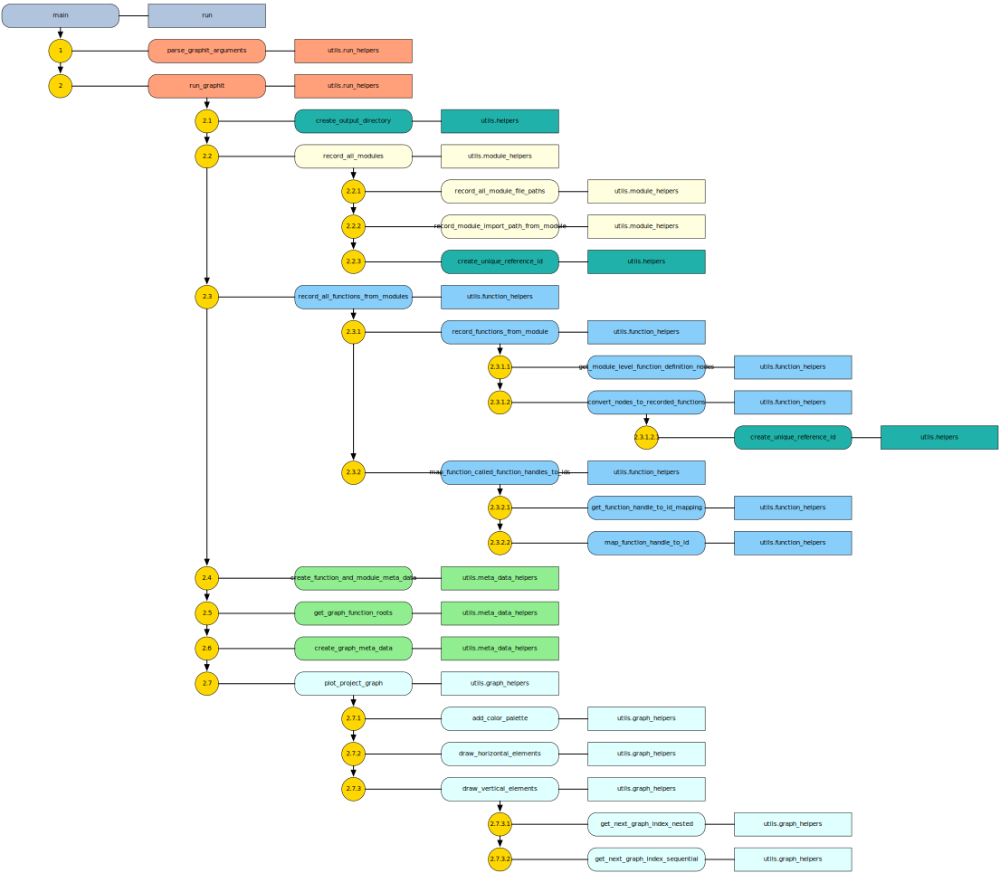

# Overview

The `graphit` package provides a simple function dependency plotting functionality.

The graphs and meta data it produces for a given python project can help track dependencies in
your code base.

The `./graphit` subdirectory of this repo can be seen as its own python project and produces the following dependency flow chart:



# Installation

First, clone this repository.

Then, make sure you have the `wheel` package installed. You can install it by simply running

```
pip install wheel
```

To build and install the `graphit` package from this source repository, from the top directory run

```
pip install .
```

# Usage

Once installed, the `graphit` package provides a convenient `run_graphit` entry point.

It can be invoked from the command line like so:

```
run_graphit -r {project_top_directory} -is {list} {of} {(sub)directories} {to} {ignore} -m {output_directory}
```

where

- `project_top_directory` is the top directory of the python project you want to map out
- `output_directory` is a local directory that will contain the meta data export files produced by running `graphit` over the specified project
- `{list} {of} {(sub)directories} {to} {ignore}` is a list of subdirectories/files separated by a space that `graphit` should ignore when scanning for python modules. Examples are local `venv` or `__pycache__` directories


For example, to create the flow chart of functional dependencies for the `grpahit` project, from the top directory of this repository simply run

```
run_graphit -r ./graphit -m outputs
```

For more configuration options, run

```
run_graphit --help
```

# Outputs

A successful run will generate a timestamped subdirectory in the specified `{output_directory}`. It contains:
- meta data on the identified in scope python modules (i.e. `*/py` files)
  - see the `.csv` file
- meta data on the functions that were parsed from all relevant python modules 
  - see the `graphit_function_meta_data.csv` file
- meta data on the function dependencies based on identified function calls
  - see the `graphit_function_dependency_meta_data.csv` file
- meta data on the graph visualizing the functional dependency flow of the project
  - see the `graphit_{function_reference_id}_graph_meta_data.csv` file
- the depenency flow diagram, compatible with most browsers
  - see the `graphit_{function_reference_id}_graph_root_diagram.html`

Finally, it will try to open the `.svg` file containing the flow chart in your default browser, too.
